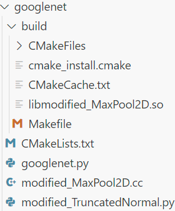

# ModelX && DeepModelX
FSE2025 Accepted Paper: "Bridging Operator Semantic Inconsistencies: A Source-level Cross-framework Model Conversion Approach" and FSE-Poster 2025 Accepted Paper : "Enhancing Deep Learning Transpilation with LLMs: Automation and Semantic Consistency"

<span style="background-color: #e0e0e0;">ModelX</span>
is a **Source-level Cross-framework Conversion Tool** for operator semantic inconsistencies. It is designed to bridge operator semantic inconsistencies. Compared to previous
IR-level approaches, ModelX offers a more detailed approach, focusing on achieving consistency at a much finer-grained level.
It includes **CMC (core Converter, containing 3,500+ LoC)** and **Evaluation (Experiments)**.
## Converter Usage
### Dependency
1. **Operating System**: 64-bit CentOS 7.9
2. **Packages**: >=Cmake-3.15; >=python 3.10
3. **Libraries**: PyTorch 1.10.0a0; Paddle 2.5.2
4. **Paths**: Complete the custom dependency library paths enclosed by '**' in <span style="background-color: #e0e0e0;">xxx_CMakeLists_template.txt</span>

All the PyPi package dependencies and their appropriate versions are captured in <span style="background-color: #e0e0e0;">requirements.txt</span> (excluding PyTorch and PaddlePaddle).
```bash
pip install -r requirements.txt
```

### Run
```bash
python main.py  --in_dir <in_file/dir> --out_dir <out_dir> --show_unspport True
# Run an example:
python main.py  --in_dir EVALUATION/datasets/models/vision/sourceModels/alexnet.py --out_dir EVALUATION/datasets/models/vision/targetModels --show_unspport True
```
Output example using **GoogleNet**:<br>



After conversion, you get a folder containing the target framework model. Run the target framework model using the following command:<br>
```bash
# When not including .so files:
python xxxx.py
# When including .so files:
LD_PRELOAD=/path/to/build/libmodified_xxx.so python xxxx.py
```
Currently, the tool mainly evaluate the conversion task from PyTorch to PaddlePaddle, so `--source_framework` and `--target_framework` do not need to be specified; they are set to defaults.

## Experiments
We designed four experiments for <span style="background-color: #e0e0e0;">ModelX</span>: <br>
**1.** evaluation for converting operators in its equivalence, <br>
**2.** evaluation for comparing it with SOTA tools, <br>
**3.** evaluation for the performance of LLMs in cross-framework model conversion, <br>
**4.** evaluation for its robustness in cross-framework model conversion. <br>

### 1. EquivalenceExperiment

In this experiment: <br>
<ol>
<li>Test pipline file.
<ul>
<li>We provide "test_operatorEquivalence_pipeline.py", which details calculating the MAE and RMSE, assessing the equivalence of converting operators by the tool. </li>
</ul>
</li>
<li>Experiment data.
<ul>
<li>We provide "EVALUATION\datasets\operators", which contain about 140+ operators test files.</li>
</ul>
</li>
</ol>


### 2. EffectivenessExperiment (Compared with ONNX and PaConvert)
In this experiment: <br>
<ol>
<li>Generating compuatation graph and weight file.
<ul>
<li>We provide "computation_graph_conversion_pipline.py", which converts the tested model into .onnx file and stores model weight. </li>
</ul>
</li>
<li>Comparison converted models using different approaches.
<ul>
<li>We provide "compareExperiment.py", which evaluates different approaches in model conversion task.</li>
</ul>
</li>
</ol>


### 3. LLMsExperiment (Compared with LLMs)
In this experiment: <br>
<ol>
<li> Two type of Promptings files.
<ul>
<li>We provide "orginal prompting.md" and "chain-of-thought prompting.md", which details the procedures of the prompts. </li>
</ul>
</li>
<li>Experiemnta data.
<ul>
<li>We provide "test model.xlsx", which details the converted result of tested models. </li>
</ul>
</li>
</ol>


### 4. RobustnessExperiment
In this experiment: <br>
<ol>
<li>Test the performance of models in the source framework and the target framework.
<ul>
<li>We provide “pytorch_model_pipeline.py” and “paddlepaddle_model_pipeline.py”, which test models in some application fields. Of course, before testing, it is necessary to use the above converter to convert the specific model into the target framework format. </li>
</ul>
</li>
<li>Experiemnta data.
<ul>
<li>We Provide "test vision models.xlsx", "test text models.xlsx" and "test audio models.xlsx" </li>
</ul>
</li>
</ol>

## Project file structure
<ul>
<li>ModelX/
<ul>
<li>README.md</li>
<li>main.py</li>
<li>CMC/
<ul>
<li>Matchers/
<ul>
<li>importMatcher.py</li>
<li>basicMatcher.py</li>
</ul>
</li>
<li>astAnalysis.py</li>
<li>converter.py</li>
<li>nodeBase.py</li>
<li>paddle_CMakeLists_template.txt</li>
<li>pytorch_to_paddlepaddle.json</li>
<li>codeGeneration.py</li>
<li>special_mapping.py</li>
<li>utils.py</li>
</ul>
</li>
<li>EVALUATION/
<ul>
<li>datasets/
<ul>
<li>models</li>
<li>operators</li>
</ul>
</li>
<li>EffectivenessExperiment</li>
<li>EquivalenceExperiment</li>
<li>LLMsExperiment</li>
<li>RobustnessExperiment</li>
</ul>
</li>
</ul>
</li>

</ul>
